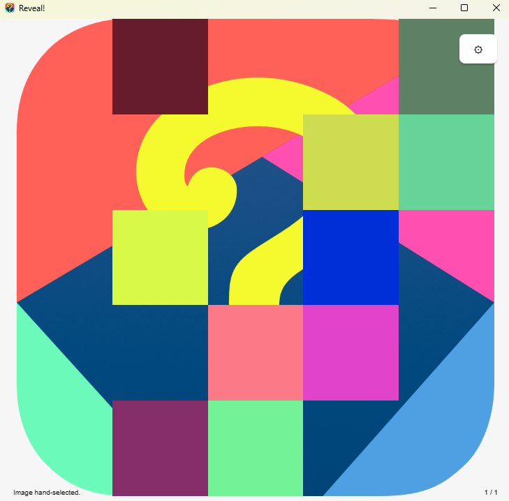
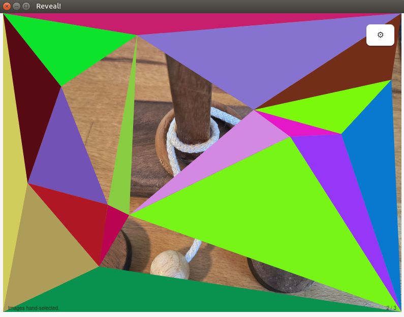
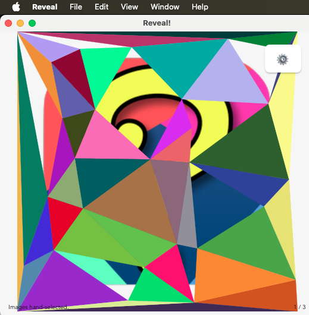
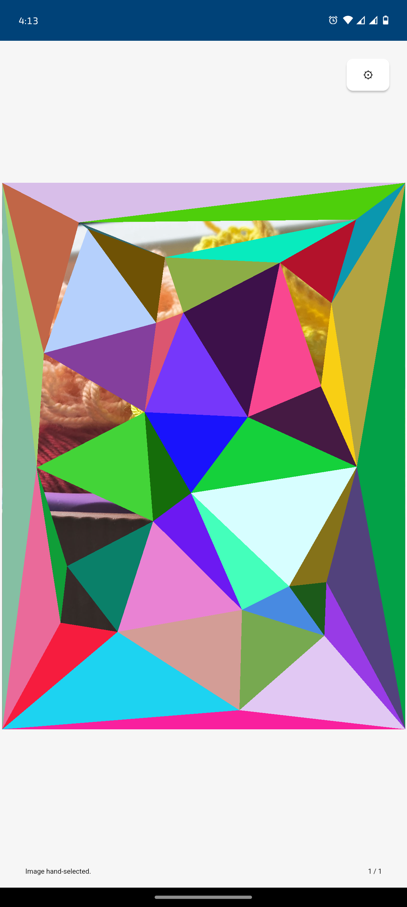
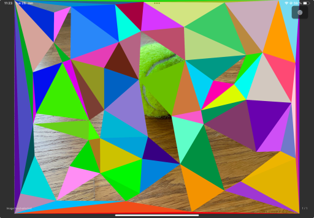

<div align="center">
  
</div>

# Reveal!

Reveal is a simple interactive game, best played as a group, where participants have to identify
a partly visible image as quick as possible.

The game does not come with images to play. You can
* collect and compile them to your linking through any image search database,
* ask your favorite image generation AI to generate them for you,
* use your personal image collection to reminisce about your past, or
* do whatever else comes to your mind.

As AI gets smaller, we may add image generation on-the-fly in the future.

## Downloads
Downloads can be found in the [releases section](https://github.com/uruuru/reveal/releases).

Windows | Linux (Ubuntu 24.04) | macOS | Android | iOS
-- | -- | -- | -- | --
 |  |  |  | 

## Controls

The game can be controlled via the control buttons in the top-right,
via hotkeys on desktops, or via touch and swipe gestures on mobile devices.

Action | Desktop | Mobile
-- | -- | --
Further uncover the image | `u` / `⎵`  | touch
Fully reveal the image | `c` / `↓` | swipe down
Next image | `n` / `→` | swipe left
Previous image | `p` / `←` | swipe right
Reset the covering | `r` / `↑` |  swipe up

## Settings

Further settings and the ability to select different images are available via the `⚙` in the top-right. Changed settings are persisted.

## Image Sources

The game tries to load images from a couple of default locations before asking the user for manual selection.
Not every platform supports every location. Access to files on Android and iOS differs from desktops.
* Desktops (in this order)
  * folder `reveal` in the user's pictures folder,
  * folder `reveal_images` next to the executable.
* Android
  * folder `reveal` in the user's pictures folder.
* iOS
  * folder `reveal` in "On My iPhone/iPad".

The user is able to manually select images via the settings,
either selecting a folder from which all images are loaded
or selecting individual images.
Due to current limitations in the underlying framework,
Android and iOS only support selecting individual images.
On iOS it is possible to either select images from files
or from Photos.


# Trivia
A simple version of the game was initially created in a single evening using Python and Qt. The motivation to re-implement it with Tauri and Rust, although seemingly overkill, was to become familiar with the framework and the language. Another goal was to understand the feasibility of developing for multiple platforms (including mobile) from a single code base.

In terms of effort distribution, building the game itself took less than 1% of the time (no surprise there). About 80% of the time was spent setting up the tools[^1], and the remaining time was spent dealing with platform-specific quirks that are not (yet) fully abstracted by Tauri.

[^1]: And learning that a physical MacBook is mandatory to properly develop and compile for macOS/iOS. Admittedly, there are some cloud offerings, but none of them seem to provide reasonable usability.

# License
The project's code is licensed under the MIT License. See [LICENSE-MIT](LICENSE-MIT) for details.

Other assets, such as logos or artwork, are not covered by the source code license.

# Development

* [Tauri](https://tauri.app/)
* Frontend in vanilla HTML, JS, and CSS
* Backend in [Rust](https://www.rust-lang.org/)

## Building

```
cargo tauri [dev/build/...]
# or
npx @tauri-apps/cli@latest [build/dev]
```

```
npx @biomejs/biome check
```

## Distribution

macOS `.app` bundle
```
cargo tauri build --bundles app --target universal-apple-darwin
```

iOS `.ipa`
```
cargo tauri ios build
```

Windows (cross-compiled on linux)
```
cargo tauri build --runner cargo-xwin --target x86_64-pc-windows-msvc
```

Android
```
cargo tauri android build --aab

cargo tauri android build --apk --split-per-abi
```
